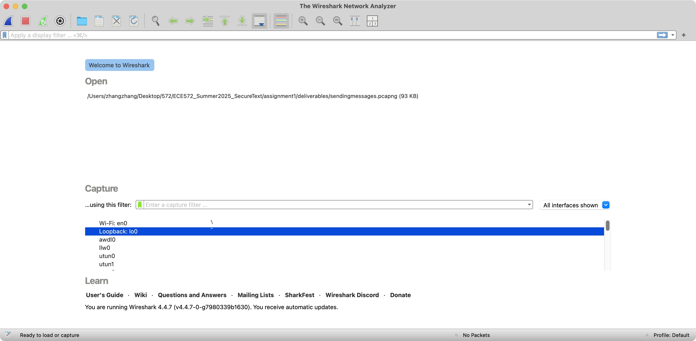
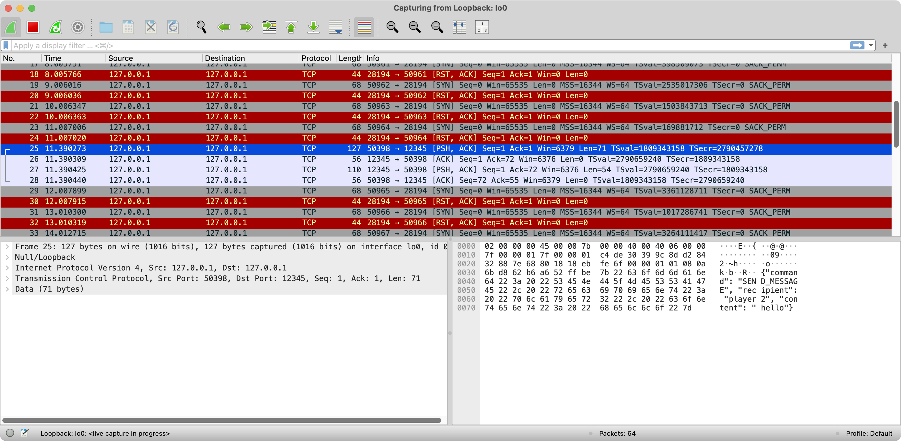
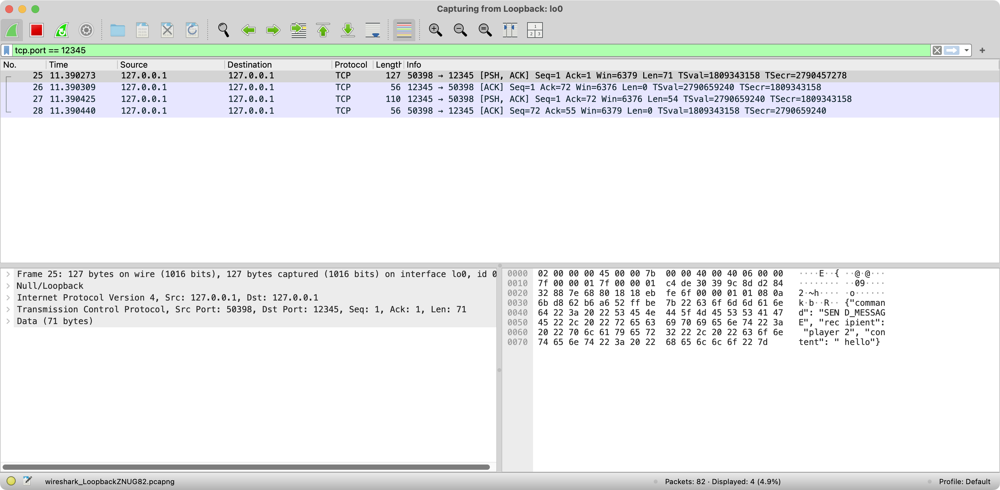

# Generic Report Template for ECE 572

**Use this template for all three assignments and modify if needed**

**This template is made by GenAI help, if you believe some changes are required or some parts need revision, feel free to send a merge request or send an email!**

---

**Course**: ECE 572; Summer 2025
**Instructor**: Dr. Ardeshir Shojaeinasab
**Student Name**: Zhang Zhang  
**Student ID**: V01046193  
**Assignment**: Assignment 1
**Date**: June 16, 2025
**GitHub Repository**: https://github.com/Zzzzzzzach/ECE572_Summer2025_SecureText

---

## Executive Summary

<!-- 
Provide a brief overview of what you accomplished in this assignment. 
For Assignment 1: Focus on vulnerabilities found and security improvements made
For Assignment 2: Focus on authentication enhancements and Zero Trust implementation  
For Assignment 3: Focus on cryptographic protocols and end-to-end security
Keep this section to 1-2 paragraphs.
-->

[Write your executive summary here]

---

## Table of Contents

1. [Introduction](#introduction)
2. [Task Implementation](#task-implementation)
   - [Task 1 Security Vulnerability Analysis](#task-x)
   - [Task Y](#task-y)
   - [Task Z](#task-z)
3. [Security Analysis](#security-analysis)
4. [Attack Demonstrations](#attack-demonstrations)
5. [Performance Evaluation](#performance-evaluation)
6. [Lessons Learned](#lessons-learned)
7. [Conclusion](#conclusion)
8. [References](#references)

---

## 1. Introduction

### 1.1 Objective
<!-- Describe the main objectives of this assignment -->

### 1.2 Scope
<!-- Define what you implemented and what you focused on -->

### 1.3 Environment Setup
<!-- Briefly describe your development environment -->
- **Operating System**: MacOS Sequoia
- **Python Version**: 3.13.0
- **Key Libraries Used**: 
- **Development Tools**: 

---

## 2. Task Implementation

<!-- Replace Task X, Y, Z with actual task numbers and names  -->

### 2.1 Task 1: Security Vulnerability Analysis
**Objective**: Analyze the provided insecure messenger application and identify security weaknesses.  

#### 1. No Password Complexity Requirements
**Category**: Authentication.  
**Description**: The application allows users to set any password without checking complexity rules such as minimum length, character diversity, or blacklisting common passwords.  
**Impact**: This exposes user accounts to brute-force and dictionary attacks.  
**Principles**: "Security of a password-based authentication system rests
entirely on the attacker’s inability to guess the password in a small
number of guesses." So increasing length or character diversity will make harder for the attacker to breach the system.   

##### Attack Scenarios
**What the attacker needs**
Access to the login interface and a dictionary of common passwords.  

**What they could achieve**
The attacker could brute-force or guess a user’s password in a small number of attempts. This leads to full account compromise.  

**Final thoughts and solution**
Systems should enforce password complexity rules.  

#### 2. Password Reset Requires No Identity Verification
**Category**: Authentication  
**Description**: The password reset functionality does not require the user’s current password, nor does it perform any meaningful identity verification. The security question is hard-coded with the same answer for all users and not used during the reset process.  
**Impact**: An attacker who knows a valid username can easily reset the corresponding password and take over the account.  
**Principles**: “The implementation must verify reset through secure means.” The Sarah Palin email hack case highlights the dangers of relying on easily guessable or publicly available reset information. However, in this application, the password can be changed without even requiring the original password.  
##### Attack Scenarios
**What the attacker needs**
A known username and access to the reset command.  

**What they could achieve**
The attacker could take over another user's account by resetting their password without proving ownership.  

**Final thoughts and solution**
Reset functions must include robust identity verification such as original password, secret questions, email verification.  

#### 3. Plaintext Storage of Usernames and Passwords on Disk
**Category**: Data Protection  
**Description**: User credentials are stored in a local JSON file in plaintext. There is no encryption or hashing applied to the data.  
**Impact**: Anyone who gains access to the disk or file system can directly read all usernames and passwords.  
**Principles**: According to Kerckhoff’s Principle, “The only thing that we keep secret from the adversary are the system’s secret keys.”. However, in this application, passwords are stored in plaintext, meaning that if the storage is exposed, all user secrets are immediately compromised.

##### Attack Scenarios
**What the attacker needs**  
File system access to users.json

**What they could achieve**  
Instant access to all usernames and passwords in plaintext.

**Final thoughts and solution**  
Sensitive user data should never be stored in plaintext. Passwords must be hashed using salted password hashing functions.

#### 4. Messages Transmitted in Plaintext Over TCP
**Category**: Communication Security  
**Description**: The application uses raw TCP sockets to transmit authentication data and chat messages without any encryption.  
**Impact**: This leaves all data vulnerable to interception and tampering by a network-level attacker.  
**Principles**: Application need to protect against eavesdropping attacks and active attacks, recommending the use of challenge-response protocols and digital signatures for secure communication.  

##### Attack Scenarios
**What the attacker needs**
Ability to sniff network traffic  

**What they could achieve**
Intercept and read messages, usernames, and passwords. The attacker could also inject or modify messages by doing man-in-the-middle attacks.  

**Final thoughts and solution**
All communication must be encrypted through TLS or other methods.  


#### 5. No Account Lockout or Rate Limiting on Login
**Category**: Authentication  
**Description**: The application does not enforce any limits on login attempts, nor does it introduce delays or blocks after failed attempts.  
**Impact**: This allows an attacker to repeatedly guess passwords without resistance, making brute-force attacks feasible.  
**Principles**: The course discussed the importance of rate limiting and guess caps to prevent online password guessing, especially in systems that rely on weak user-chosen passwords.  

##### Attack Scenarios
**What the attacker needs**
Access to the login interface.

**What they could achieve**
They could perform an online brute-force attack, testing hundreds or thousands of passwords until one works.

**Final thoughts and solution**
Application could use protections such as rate limiting, exponential backoff, and account lockouts to prevent brute-force attacks on authentication endpoints.


### 2.2 Task 2: Securing Passwords at Rest 

#### 2.2.1 Part A: Password Hashing Implementation
Goals:  
- Modify the create_account() method to hash passwords before storing
- Update the authenticate() method to compare hashed passwords

I add two methods to do hashing and verification
```python
# A global variable HASH_METHOD was added to switch between sha256 and bcrypt
    HASH_METHOD = "bcrypt"

    def hash_password(self, password, method=HASH_METHOD) -> str:
        if method == "sha256":
            return hashlib.sha256(password.encode('utf-8')).hexdigest()
        elif method == "bcrypt":
            salt = bcrypt.gensalt(rounds=12)
            return bcrypt.hashpw(password.encode('utf-8'), salt).decode('utf-8')
        else:
            return password

    def verify_password(self, password, stored_hash, method=HASH_METHOD) -> bool:
        if method == "sha256":
            return hashlib.sha256(password.encode('utf-8')).hexdigest() == stored_hash
        elif method == "bcrypt":
            return bcrypt.checkpw(password.encode('utf-8'), stored_hash.encode('utf-8'))
        else:
            return password == stored_hash
```

I also save the hash method in the json file. In create_account() and authenticate(), the appropriate hash method is selected dynamically.
``` python
    def create_account(self, username, password):
        .....

        self.users[username] = {
            'password': hashed_pw, 
            'hash_method': HASH_METHOD,
            'created_at': datetime.now().isoformat(),
            'reset_question': 'What is your favorite color?',
            'reset_answer': 'blue'  
        }
        self.save_users()
        return True, "Account created successfully"
    
    def authenticate(self, username, password):
        ....
        
        if self.verify_password(password, self.users[username]['password'], self.users[username].get("hash_method", "plaintext")):
            return True, "Authentication successful"
        else:
            return False, "Invalid password"
    
```
Actually, reset_password() also needs to be modified so that the application could runs properly.
```python
    def reset_password(self, username, new_password):
        ....

        self.users[username]['password'] = hashed_pw
        self.users[username]['hash_method'] = HASH_METHOD
        self.save_users()
        return True, "Password reset successful"
```
**SHA-256 limitations**: While **SHA-256** provides cryptographic integrity, it is a fast hash function, which makes it susceptible to brute-force and dictionary attacks. Because of its speed, attackers using modern GPUs or ASICs can try millions of password guesses per second.  


Goals:
- Research and implement a slow hash function (PBKDF2, bcrypt, scrypt, or Argon2)
- Justify your choice of hash function and parameters
- Demonstrate the time difference between fast and slow hashing

I choose to use **bcrypt** because it:    
- Adds a random salt automatically
- Allows configuration of work factor (rounds) to increase computational cost

Changing the global variable HASH_METHOD to "bcrypt" could change all read and write process to use bcrypt. I use the adjustable cost factor (rounds=12) to makes it computationally expensive for attackers. This cost factor results in roughly 200 ms per hash on a standard CPU, which significantly increases the difficulty of large-scale password cracking. It also compatible with JSON-friendly storage via .decode('utf-8').  

For the time difference, I tested two methods on random passwords:
```
       sha256 costs 3.0994415283203125e-05 seconds to complete.
       sha256 costs 2.4080276489257812e-05 seconds to complete.
       sha256 costs 1.6927719116210938e-05 seconds to complete.
       sha256 costs 1.5974044799804688e-05 seconds to complete.
       sha256 costs 2.47955322265625e-05 seconds to complete.

       bcrypt costs 0.21899008750915527 seconds to complete.
       bcrypt costs 0.21755099296569824 seconds to complete.
       bcrypt costs 0.21746587753295898 seconds to complete.
       bcrypt costs 0.21658706665039062 seconds to complete.
       bcrypt costs 0.21867704391479492 seconds to complete.
```
This demonstrates that bcrypt is approximately 10,000 times slower than SHA-256, effectively deterring brute-force attempts.


#### 2.2.2 Part B: Part B: Salt Implementation  
In the original version of the application, password hashing was implemented using bcrypt. One of the strengths of bcrypt is that it automatically generates a unique 128-bit salt internally and embeds this salt within the final hash string. This means that explicit salt management is typically unnecessary when using bcrypt alone.

However, for the purpose of this assignment and in consideration of future extensibility, I chose to manually generate a separate 128-bit salt for each user. This salt is:

- Stored separately alongside the user data

- Concatenated with the original password before being passed into the bcrypt hashing function

This design allows the application to simulate and demonstrate the explicit salting process, which is often necessary when using other hash functions like PBKDF2, scrypt, or Argon2, where manual salt handling is required.

First, I added a static method to generate a random salt.  
```python
    @staticmethod
    def generate_salt():
        return base64.b64encode(os.urandom(16)).decode('utf-8')
```

Then, I modified the hash_password and verify_password methods to combine the input password with the generated salt before hashing.
```python
    def hash_password(self, password, salt, method=HASH_METHOD) -> str:
        if method == "sha256":
            return hashlib.sha256(password.encode('utf-8')).hexdigest()
        elif method == "bcrypt":
            #
            password = password+salt
            return bcrypt.hashpw(password.encode('utf-8'), bcrypt.gensalt(rounds=12)).decode('utf-8')
        else:
            return password
```
Finally, I updated the parts of the application that call these methods—such as create_account, authenticate, and reset_password. In create_account and reset_password, I also store the salt into the JSON file:  
```python
    def create_account(self, username, password):
        if username in self.users:
            return False, "Username already exists"
        salt = self.generate_salt()
        hashed_pw = self.hash_password(password, salt, HASH_METHOD)
        self.users[username] = {
            'password': hashed_pw,  # PLAINTEXT PASSWORD!
            'hash_method': HASH_METHOD,
            'salt': salt,
            'created_at': datetime.now().isoformat(),
            'reset_question': 'What is your favorite color?',
            'reset_answer': 'blue'  # Default for simplicity
        }
        self.save_users()
        return True, "Account created successfully"
        
    def authenticate(self, username, password):
        """Authenticate user with plaintext password comparison"""
        if username not in self.users:
            return False, "Username not found"
        
        if self.verify_password(password, self.users[username]['password'], self.users[username].get('salt'), self.users[username].get("hash_method", "plaintext")):
            return True, "Authentication successful"
        else:
            return False, "Invalid password"

```

To support a smooth transition from insecure plaintext password storage to secure hashing with salt, I implemented a password migration mechanism within the authentication flow.

The system checks the user's hash_method field during authentication. If this field is missing or set to "plaintext", the system assumes the stored password is in plaintext and performs a direct string comparison. This ensures that existing users can still log in without requiring an immediate password reset after the system is updated.  

Once a legacy user successfully logs in:  
- The system automatically upgrades their password to a hashed version using the current secure method (bcrypt with salt).  
- A new random salt is generated using generate_salt().  
- The new hashed password, salt, and the hashing method are stored back into the user data.  

This upgrade is handled by the migrate_plaintext_user() method, and is triggered immediately after successful authentication of a plaintext-stored password.
```python
    def migrate_plaintext_user(self, username, password):
        salt = self.generate_salt()
        hashed_pw = self.hash_password(password, salt, HASH_METHOD)

        self.users[username]['password'] = hashed_pw
        self.users[username]['salt'] = salt
        self.users[username]['hash_method'] = HASH_METHOD
        self.save_users()

```
By doing so, the system ensures that over time, all user accounts are gradually upgraded to use secure salted hashing, without breaking compatibility or forcing users to take any manual action.

**Another way**
Another way to migrate existing plaintext passwords is by using a standalone script to batch process user records. This script reads the users.json file, detects accounts that still store passwords in plaintext, and upgrades them by generating a unique 128-bit salt for each user. The code in /deliverable/mitigate_plaintext.py uses this approach to perform the mitigation.
```python
# Core code
with open(USER_FILE, "r", encoding="utf-8") as f:
    users = json.load(f)

updated_count = 0

for username, user_data in users.items():
    hash_method = user_data.get("hash_method", "plaintext")
    
    if hash_method == "plaintext":
        plaintext_password = user_data["password"]
        salt = generate_salt()
        hashed = hash_password(plaintext_password, salt)

        user_data["password"] = hashed
        user_data["salt"] = salt
        user_data["hash_method"] = "bcrypt"

        updated_count += 1

with open(USER_FILE, "w", encoding="utf-8") as f:
    json.dump(users, f, indent=2)
print(f"Migrated {updated_count} user(s) to bcrypt with salt.")

```


#### 2.2.3 Attack Demonstration
#### 2.2.3.1 Dictionary Attack Simulation
To demonstrate the effectiveness of salting in protecting passwords from dictionary and rainbow table attacks, I implemented a simple dictionary attack in the function salt_vs_unsalt_demo():
```python
def salt_vs_unsalt_demo():
    # The password under attack is "password123"
    # And a dictionary of common weak passwords is defined:

    password = "password123"
    dictionary = ["123456", "password", "password123", "admin", "654321", "11111111", "qwerty"]
    
    # The attacker hashes each dictionary word and compares it with the unsalted hash. 
    # Since "password123" is present in the dictionary, the attack succeeds almost instantly
    # The output is "found unsalted password in 0.000007153s"
    unsalted_hash_password = hashlib.sha256(password.encode()).hexdigest()
    
    start = time.time()
    for word in dictionary:
        guess = hashlib.sha256(word.encode()).hexdigest()
        if guess == unsalted_hash_password:
            print(f"found unsalted password in {(time.time()-start):.9f}s")


    # A 128-bit random salt is generated and appended to the password
    # During the dictionary attack, the attacker doesn't know the salt, so the guess hashes do not match
    salt = base64.b64encode(os.urandom(16)).decode('utf-8')
    salted_input = password + salt
    salted_hash = hashlib.sha256(salted_input.encode()).hexdigest()
    start = time.time()
    for word in dictionary:
        guess = hashlib.sha256(word.encode()).hexdigest()  
        if guess == salted_hash:
            print(f"found salted password in {(time.time()-start):.9f}s")    
```

So even though the password "password123" is in the dictionary, the hash does not match the salted hash. The attack fails.

**Salted hashes** are immune to rainbow tables, because:

- The same password always produces different hashes per salt
- Attackers can't precompute hashes without knowing the salt
#### 2.2.3.2 Performance Analysis
**Hashing Speed Comparison**  
We used the same input password "password123" and measured the time it takes to compute one hash using each method. 
```python
def slow_vs_fast_hash_demo():
    password = "password123"
    # SHA256
    start_sha = time.time()
    sha256_result = hashlib.sha256(password.encode()).hexdigest()
    end_sha = time.time()
    sha256_time = end_sha - start_sha

    # bcrypt
    start_bcrypt = time.time()
    bcrypt_result = bcrypt.hashpw(password.encode(), bcrypt.gensalt(rounds=12))
    end_bcrypt = time.time()
    bcrypt_time = end_bcrypt - start_bcrypt

    print("=== Performance Comparison ===")
    print(f"SHA-256 Hash Time: {sha256_time:.9f} seconds")
    print(f"bcrypt Hash Time: {bcrypt_time:.9f} seconds")
```
The output is:
```
SHA-256 Hash Time: 0.000000715 seconds
bcrypt Hash Time: 0.241199255 seconds
```

**Theoretical brute-force times**
Assuming the password consists of 8 characters from lowercase letters and digits (a–z, 0–9), the total keyspace is:  


``36^8 = 2,821,109,907,456``


Based on actual hash timings measured during the test (SHA-256: 0.715 μs and bcrypt: 0.241 s per guess), we estimate that a brute-force attack on an 8-character password (lowercase + digits) would take approximately **23.4 days using SHA-256.** But the same attack would take over **21,600 years using bcrypt.**

This result illustrates the critical advantage of slow hashing: it dramatically increases the cost of exhaustive attacks, even when the attacker has unlimited resources.


---

### 2.3 Task 3: Network Security and Message Authentication 

#### 2.3.1 Objective
The application sends messages in plaintext over the network, making them vulnerable to eavesdropping and tampering. You will implement and demonstrate these attacks and implement message authentication codes.

#### 2.3.2 Part A: Network Attack Demonstrations
#### 2.3.2.1 Troubleshooting
I found a critical issue caused by **multiple threads simultaneously calling recv() on the same socket**. Specifically, both the main thread (waiting for command responses) and a background listener thread (receiving chat messages) attempted to read from the socket concurrently. This problem resulted in the application appearing to freeze or become unresponsive during certain operations. For example, when I first login into an account and then try to list all users, the application got freezed.

To solve this issue, I restructured the client as follows:

1. Moved listen_for_messages() to run immediately after socket connection.
This ensures that only one thread (listen_for_messages) is ever calling recv() on the socket.
```python
    def connect(self):
        """Connect to the server"""
        try:
            self.socket = socket.socket(socket.AF_INET, socket.SOCK_STREAM)
            self.socket.connect((self.host, self.port))
            threading.Thread(target=self.listen_for_messages, daemon=True).start()

            return True
            .....
```

2. Differentiated server responses using message type.

If a message from the server contains 'type': 'MESSAGE', it is printed as a chat message.
Otherwise, it is treated as a command response.
```python
    def listen_for_messages(self):
        """Listen for incoming messages in a separate thread"""
        while True:
            try:
                data = self.socket.recv(1024).decode('utf-8')
                if data:
                    message = json.loads(data)
                    print(f"listen received message {message}")
                    if self.username != None and message.get('type') == 'MESSAGE':
                        print(f"\n[{message['timestamp']}] {message['from']}: {message['content']}")
                        print(">> ", end="", flush=True)
                    else:
                        self.last_command_response = message
                        self.response_event.set()
            except:
                break
```

3. Used shared state and synchronization:
- Introduced self.last_command_response to store non-chat responses.
- Used a threading.Event object (self.response_event) to notify the main thread that a response has arrived.
- send_command() now calls self.response_event.wait() to pause until a response is received, ensuring thread-safe communication.
```python
    def __init__(self, host='localhost', port=12345):
        self.host = host
        self.port = port
        self.socket = None
        self.logged_in = False
        self.username = None
        self.running = False
        self.last_command_response = None
        self.response_event = threading.Event()
    
    def send_command(self, command_data):
        """Send command to server and get response"""
        try:
            self.socket.send(json.dumps(command_data).encode('utf-8'))
            if self.response_event.wait(timeout=5):  # wait max 5 seconds
                print(self.last_command_response)
                response = self.last_command_response
                self.last_command_response = None
                self.response_event.clear()
                return response
                ....
```


#### 2.3.2.2 Eavesdropping Attack
To demonstrate the lack of communication security in the SecureText application, I captured network traffic using Wireshark while sending a message between two users.

The SecureText server and client were both running on the same machine, communicating over TCP via the localhost (loopback) interface.

Wireshark was configured to listen on the lo0 interface (macOS loopback) to capture internal socket traffic.

After starting the capture, I sent a chat message from one user to another using the SecureText client.

The message payload appeared in plaintext in the TCP stream, formatted as JSON.

Because the server listens on port 12345, I applied the filter tcp.port == 12345 to capture all traffic related to the application.  



#### 2.3.2.3 Message Tampering Concept
An attacker can perform a Man-in-the-Middle (MitM) attack by positioning themselves on the same network (e.g., public Wi-Fi) and intercepting plaintext messages sent over TCP. Since the messages are unencrypted, tools like Wireshark can capture and read them easily. Without message authentication, the attacker can inject or modify JSON messages (e.g., fake chat or command responses) without detection.

Tools such as Ettercap, Bettercap, and mitmproxy enable ARP spoofing and packet modification. Scapy and Netcat can craft or relay malicious responses. These tools allow attackers to manipulate communication in real time, exploiting the lack of encryption and message integrity protection in the SecureText protocol.


#### 2.3.3 Part B: Flawed MAC Implementation
#### 2.3.3.1 Implement H(k||m) MAC
First, we assume that both the client and server share a pre-distributed secure key: SHARED_KEY. We then implement two functions: generate_mac and verify_mac, which are used to generate and verify the message authentication code (MAC).  
```python
    SHARED_KEY = b'this_is_a_secret_shared_key'

    @staticmethod
    def generate_mac(message: str) -> str:
        return hashlib.md5(SHARED_KEY + message.encode('utf-8')).hexdigest()
    
    def verify_mac(self, message: str, mac: str) -> bool:
        return self.generate_mac(message) == mac
```
When sending a message, we generate the MAC using the message content as input, and include the resulting MAC in the payload.  
```python
    def send_message(self):
        ....
        content = input("Enter message: ").strip()
        mac = self.generate_mac(content)
        if not recipient or not content:
            print("Recipient and message cannot be empty!")
            return
        
        command = {
            'command': 'SEND_MESSAGE',
            'recipient': recipient,
            'content': content,
            'mac': mac
        }
        ...
```
When receiving a message, we verify its integrity by checking the received MAC against a newly generated MAC based on the received content.   
```python
    def listen_for_messages(self):
        ....
        if not self.verify_mac(message['content'], message.get('mac')):
            print("mac not match")
            print(f"{mac}, {self.generate_mac(message['content'])}")
        else:
            print(f"\n[{message['timestamp']}] {message['from']}: {message['content']}")
            print(">> ", end="", flush=True)
        .....
```


---

## 3. Security Analysis

### 3.1 Vulnerability Assessment
<!-- For Assignment 1: Document vulnerabilities found in the base application -->
<!-- For Assignment 2/3: Analyze security improvements made -->

**Identified Vulnerabilities** (Assignment 1):
| Vulnerability | Severity | Impact | Location(function/action) | Mitigation |
|---------------|----------|---------|----------|------------|
| N/A | N/A | N/A | N/A | N/A |
| N/A | N/A | N/A | N/A | N/A |
| N/A | N/A | N/A | N/A | N/A |

### 3.2 Security Improvements
<!-- Document the security enhancements you implemented -->

**Before vs. After Analysis**:
- **Authentication**: [If applicable otherwise remove][How it improved]
- **Authorization**: [If applicable otherwise remove][How it improved]  
- **Data Protection**: [If applicable otherwise remove][How it improved]
- **Communication Security**: [If applicable otherwise remove][How it improved]

### 3.3 Threat Model
<!-- Describe the threats your implementation addresses -->

**Use the following security properties and threat actors in your threat modeling. You can add extra if needed.**

**Threat Actors**:
1. **Passive Network Attacker**: Can intercept but not modify traffic
2. **Active Network Attacker**: Can intercept and modify traffic
3. **Malicious Server Operator**: Has access to server and database
4. **Compromised Client**: Attacker has access to user's device

**Security Properties Achieved**:
- [ ] Confidentiality
- [ ] Integrity  
- [ ] Authentication
- [ ] Authorization
- [ ] Non-repudiation
- [ ] Perfect Forward Secrecy
- [ ] Privacy

---

## 4. Attack Demonstrations

### 4.1 Attack 1: [Attack Name]

#### 4.1.1 Objective
<!-- What vulnerability does this attack exploit? -->

#### 4.1.2 Attack Setup
<!-- Describe your attack setup and tools used -->

**Tools Used**:
- Tool 1: [Purpose]
- Tool 2: [Purpose]

#### 4.1.3 Attack Execution
<!-- Step-by-step description of the attack -->

1. Step 1: [Description]
2. Step 2: [Description]
3. Step 3: [Description]

#### 4.1.4 Results and Evidence
<!-- Show evidence of successful attack -->

**Evidence**:


```
Attack Output:
[Include relevant logs or outputs]
```

#### 4.1.5 Mitigation
<!-- How did you fix this vulnerability? -->

---

### 4.2 Attack 2: [Attack Name]

#### 4.2.1 Objective
#### 4.2.2 Attack Setup  
#### 4.2.3 Attack Execution
#### 4.2.4 Results and Evidence
#### 4.2.5 Mitigation

---

## 5. Performance Evaluation
Basic test results in terms of resources used in terms of hardware and time. Also, if the test has limitations and fix worked properly(test passed or failed)

**Measurement Setup**:
- Test Environment: [Descriptions+Screenshots]
- Test Data: [Descriptions+Screenshots]
- Measurement Tools/Methods: [Descriptions+Screenshots]
- Test Results: [Descriptions+Screenshots]

---

## 6. Lessons Learned

### 6.1 Technical Insights
<!-- What did you learn about security implementations? -->

1. **Insight 1**: [Description]
2. **Insight 2**: [Description]
.
.
.
N. **Insight N**: [Description]

### 6.2 Security Principles
<!-- How do your implementations relate to fundamental security principles? -->

**Applied Principles**:
- **Defense in Depth**: [How you applied this]
- **Least Privilege**: [How you applied this]
- **Fail Secure**: [How you applied this]
- **Economy of Mechanism**: [How you applied this]

---

## 7. Conclusion

### 7.1 Summary of Achievements
<!-- Summarize what you accomplished -->

### 7.2 Security and Privacy Posture Assessment
<!-- How secure is your final implementation? -->

**Remaining Vulnerabilities**:
- Vulnerability 1: [Description and justification]
- Vulnerability 2: [Description and justification]

**Suggest an Attack**: In two lines mention a possible existing attack to your current version in abstract

### 7.3 Future Improvements
<!-- What would you do if you had more time? -->

1. **Improvement 1**: [Description]
2. **Improvement 2**: [Description]

---

## 8. References

<!-- 
Include all sources you referenced, including:
- Course materials and lecture notes
- RFCs and standards
- Academic papers
- Documentation and libraries used
- Tools and software references
-->

---

## Submission Checklist

Before submitting, ensure you have:

- [ ] **Complete Report**: All sections filled out with sufficient detail
- [ ] **Evidence**: Screenshots, logs, and demonstrations included
- [ ] **Code**: Well-named(based on task and whether it is an attack or a fix) and well-commented and organized in your GitHub repository deliverable directory of the corresponding assignment
- [ ] **Tests**: Security and functionality tests implemented after fix
- [ ] **GitHub Link**: Repository link included in report and Brightspace submission
- [ ] **Academic Integrity**: All sources properly cited, work is your own

---

**Submission Instructions**:
1. Save this report as PDF: `[StudentID]_Assignment[X]_Report.pdf`
2. Submit PDF to Brightspace
3. Include your GitHub repository fork link in the Brightspace submission comments
4. Ensure your repository is private until after course completion otherwise you'll get zero grade

**Final Notes**:
- Use **GenAI** for help but do not let **GenAI** to do all the work and you should understand everything yourself
- If you used any **GenAI** help make sure you cite the contribution of **GenAI** properly
- Be honest about limitations and challenges
- Focus on demonstrating understanding, not just working code
- Proofread for clarity and technical accuracy

Good luck!
